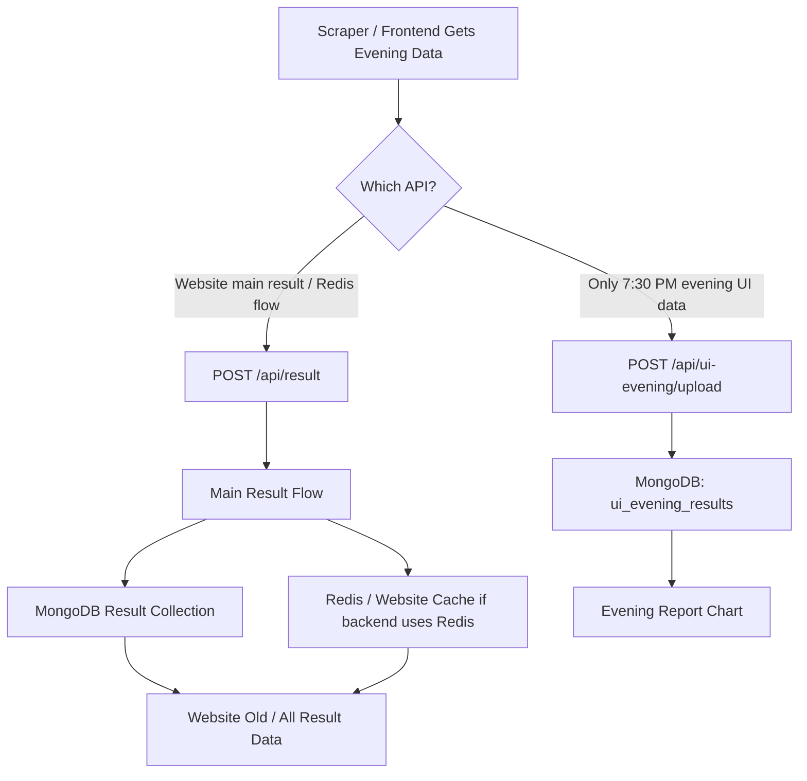

# Evening Result API Documentation

This document is only for the **7:30 PM evening result API**, **scraper result API**, and **date-wise report chart display**.

Use this in the Next.js frontend/backend service.

## Base URL

```txt
Production: https://api.mdresult.com
Local:      http://localhost:5000
```

All API routes start with `/api`.

## Required Auth

Both APIs require JWT:

```txt
Authorization: Bearer <authCode>
```

Get `authCode` from:

```txt
POST {BASE_URL}/api/login
```

Login body:

```json
{
  "email": "user@example.com",
  "password": "your-password"
}
```

Login success:

```json
{
  "message": "Login successful",
  "authCode": "JWT_TOKEN"
}
```

## Flow Chart



## API 1: 7:30 PM Evening Upload

Use this when the frontend needs to upload only the **7:30 PM** result into evening UI storage.

```txt
POST {BASE_URL}/api/ui-evening/upload
```

This API stores data in:

```txt
MongoDB collection: ui_evening_results
```

Important:

- This API is only for `07:30 PM`.
- This API does not update the main `Result` flow.
- This API does not update Redis.
- Use this only when data should go to `ui_evening_results`.
- If 40 records come from this API/source, treat those 40 records as evening records only.

Headers:

```txt
Content-Type: application/json
Authorization: Bearer <authCode>
X-Category-Key: <CATEGORY_UPLOAD_KEY>
```

Body:

```json
{
  "categoryname": "Mini Desawar",
  "date": "2026-05-07",
  "time": "07:30 PM",
  "result": "ok",
  "number": 42,
  "next_result": "07:30 PM",
  "mode": "manual"
}
```

Success response:

```json
{
  "message": "Created",
  "data": {}
}
```

or:

```json
{
  "message": "Updated",
  "data": {}
}
```

Common errors:

```txt
400 = missing/invalid fields
401 = missing JWT
403 = invalid JWT or invalid category key
500 = server error
```

## Next.js Route For Evening API

Create this in frontend:

```txt
app/api/evening-result/route.js
```

```javascript
export async function POST(request) {
  const body = await request.json();

  const res = await fetch(
    `${process.env.MINIBACKEND_BASE_URL}/api/ui-evening/upload`,
    {
      method: "POST",
      headers: {
        "Content-Type": "application/json",
        Authorization: `Bearer ${process.env.MINIBACKEND_AUTH_CODE}`,
        "X-Category-Key": process.env.CATEGORY_UPLOAD_KEY,
      },
      body: JSON.stringify({
        categoryname: body.categoryname || process.env.CATEGORY_NAME,
        date: body.date,
        time: "07:30 PM",
        result: body.result || "ok",
        number: body.number,
        next_result: "07:30 PM",
        mode: body.mode || "manual",
      }),
    }
  );

  const json = await res.json();
  return Response.json(json, { status: res.status });
}
```

Frontend call:

```javascript
await fetch("/api/evening-result", {
  method: "POST",
  headers: {
    "Content-Type": "application/json",
  },
  body: JSON.stringify({
    categoryname: "Mini Desawar",
    date: "2026-05-07",
    number: 42,
    result: "ok",
    mode: "manual",
  }),
});
```

## API 2: Scraper Data API

Use this API when the **scraper data should go to the main website result flow**.

```txt
POST {BASE_URL}/api/result
```

This is the API for data that should appear in old/all website result data.

Important:

- Scraper data should use this API if website needs to show it in normal result list.
- This is the existing main result flow.
- If backend uses Redis/cache for result display, this flow is the one connected with that main result behavior.
- Do not use `/api/ui-evening/upload` for scraper data if the data must update main website/Redis result flow.

Headers:

```txt
Content-Type: application/json
Authorization: Bearer <authCode>
```

Body for scraper:

```json
{
  "categoryname": "Mini Desawar",
  "date": "2026-05-07",
  "time": "07:30 PM",
  "number": "42",
  "next_result": "07:30 PM",
  "result": [
    {
      "time": "07:30 PM",
      "number": "42"
    }
  ],
  "key": "md-9281",
  "phone": "",
  "isAutoScheduled": true
}
```

Success example:

```json
{
  "message": "Result saved successfully"
}
```

## Report Chart Data

The report chart should show evening data **date-wise**.

For display, show **only Mini Desawar** rows. Do not show `Minidiswar` data in this report chart. Mask the displayed data as `XX`.

Example chart/table display:

```txt
Date        Name          Time       Data
2026-05-07  Mini Desawar  07:30 PM   XX
2026-05-08  Mini Desawar  07:30 PM   XX
2026-05-09  Mini Desawar  07:30 PM   XX
```

If 40 evening records come, first filter only `Mini Desawar`, then render those date-wise rows/cards. Any `Minidiswar` records must be ignored.

Frontend mapping:

```txt
Date: date
Name: categoryname
Time: time
Data: XX
```

Example render logic:

```javascript
const miniDesawarRows = eveningResults
  .filter((item) => item.categoryname?.trim().toLowerCase() === "mini desawar")
  .map((item) => ({
    date: item.date,
    name: "Mini Desawar",
    time: item.time || "07:30 PM",
    data: "XX",
  }));
```

## Which API To Use?

```txt
Only 7:30 PM evening UI storage:
POST /api/ui-evening/upload

Scraper data / website result / Redis-main flow:
POST /api/result
```

## Environment Variables For Next.js

```env
MINIBACKEND_BASE_URL=https://api.mdresult.com
MINIBACKEND_AUTH_CODE=YOUR_LOGIN_JWT
CATEGORY_UPLOAD_KEY=YOUR_CATEGORY_KEY
CATEGORY_NAME=Mini Desawar
```

Do not use `NEXT_PUBLIC_` for token or category key.
