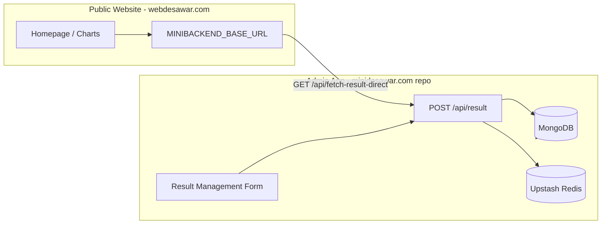

# Website API Update Guide

Pehle **Mini Desawar result data** `https://api.mdresult.com` se aata tha. Ab admin + API **is project** (`minidesawar.com` / result-management app) ke andar hain.

Website project: **`webdesawar.com`** (public site — `minidesawar.com` domain).

Yeh document batata hai website par **kya change karna hai**, kaunsi **env** update karni hai, aur kaunse **API endpoints** chahiye.

---

## 1. Pehle vs Ab (Architecture)

| Pehle | Ab |
|--------|-----|
| Admin UI → `https://api.mdresult.com/api/*` | Admin UI → same app `/api/*` (`static.js` → `HOST = '/api'`) |
| Website → `MINIBACKEND_BASE_URL=https://api.mdresult.com` | Website → **nayi API host** (jahan yeh Next app deploy ho) |
| Redis / Mongo → purana backend | **Same** Mongo + Upstash (`.env` mein same URI/token) |



---

## 2. Naya API Base URL (Website ke liye)

Jahan **admin + API** deploy karo (example):

| Environment | `MINIBACKEND_BASE_URL` example |
|-------------|--------------------------------|
| Local admin API | `http://localhost:3000` |
| Production | `https://admin.minidesawar.com` ya jahan bhi API host ho |

**Important:** URL ke end par `/api` mat lagao — code khud `/api/...` append karta hai.

### Purana (hata do)

```env
MINIBACKEND_BASE_URL=https://api.mdresult.com
```

### Naya

```env
MINIBACKEND_BASE_URL=https://YOUR-DEPLOYED-ADMIN-API-DOMAIN.com
```

---

## 3. Website par Environment Variables

File: **`webdesawar.com/.env.local`** (local) ya **Vercel → Environment Variables** (production).

### 3.1 Zaroori — Mini Desawar results

| Variable | Kya hai | Kaise set karein |
|----------|---------|------------------|
| `MINIBACKEND_BASE_URL` | Naya API host (section 2) | Deploy URL without trailing slash |
| `MINIBACKEND_AUTH_CODE` | Admin login JWT | Admin par login → `POST /api/login` → `authCode` copy karo |
| `CATEGORY_NAME` | Category filter | `Minidesawer` (website default) |

`MINIBACKEND_AUTH_CODE` lane ka tareeka:

1. Admin app kholo → login (`email` + `password`)
2. Browser DevTools → Network → `POST /api/login` response → `authCode`
3. Ya login ke baad `localStorage.getItem('authToken')`
4. Website **server-only** env mein paste karo (kabhi `NEXT_PUBLIC_` mat use karo)

Token ~24h valid (JWT). Expire hone par dubara login se naya token.

### 3.2 Scrapper / general results (alag API — change nahi)

| Variable | Use |
|----------|-----|
| `NEXT_PUBLIC_API_BASE_URL` | `GET /api/latest` — scrapper / other games |

Yeh **api.mdresult.com se related nahi** — agar scrapper alag server par hai to waisa hi rehne do.

### 3.3 Optional — Evening 7:30 PM upload

| Variable | Use |
|----------|-----|
| `CATEGORY_UPLOAD_KEY` | `POST /api/ui-evening/upload` header `X-Category-Key` |

Sirf tab jab website se evening API use ho.

### 3.4 Optional — Redis cache purge

| Variable | Use |
|----------|-----|
| `MINIBACKEND_CACHE_PURGE_SECRET` | `POST /api/cache/invalidate` |
| `MINIBACKEND_CACHE_PURGE_PATH` | Default: `/api/cache/invalidate` |

### 3.5 Example — `webdesawar.com/.env.local`

```env
NEXT_PUBLIC_API_BASE_URL=https://scrapper-test-ten.vercel.app
NEXT_PUBLIC_SITE_URL=https://minidesawar.com
CATEGORY_NAME=Minidesawer

# Naya backend (admin API deploy URL)
MINIBACKEND_BASE_URL=http://localhost:3000
MINIBACKEND_AUTH_CODE=eyJhbGciOiJIUzI1NiIsInR5cCI6IkpXVCJ9...

# Evening upload (optional)
CATEGORY_UPLOAD_KEY=your-category-key
```

---

## 4. Website Code — Kaunsi Files API Use Karti Hain

| File | API call | Action |
|------|----------|--------|
| `app/lib/mini-desawar-data.ts` | `GET {MINIBACKEND_BASE_URL}/api/fetch-result-direct` | Sirf env change — **endpoint naye backend par hona chahiye** |
| `app/api/result/route.ts` | `POST {MINIBACKEND_BASE_URL}/api/result` | Env + **auth header fix** (section 5) |
| `app/api/evening-result/route.ts` | `POST .../api/ui-evening/upload` | Env; endpoint naye backend par (optional) |
| `app/lib/mini-backend-cache.ts` | Redis key list + optional purge | Same Upstash = same keys |
| `app/lib/api.ts` | `NEXT_PUBLIC_API_BASE_URL/api/latest` | **No change** (scrapper) |

---

## 5. Website Code Fix — `POST /api/result` Auth

Purana `api.mdresult.com` kabhi body mein `authcode` leta tha bina `Authorization` header ke.

**Naya backend** (`minidesawar.com` app) JWT **`Authorization: Bearer`** maangta hai.

### File: `webdesawar.com/app/api/result/route.ts`

**Purana (galat naye backend ke liye):**

```typescript
const upstream = await fetch(`${baseUrl}/api/result`, {
  method: "POST",
  headers: { "Content-Type": "application/json" },
  body: JSON.stringify({ ...payload, authcode: authCode }),
  cache: "no-store",
});
```

**Naya (sahi):**

```typescript
const upstream = await fetch(`${baseUrl}/api/result`, {
  method: "POST",
  headers: {
    "Content-Type": "application/json",
    Authorization: `Bearer ${authCode}`,
  },
  body: JSON.stringify(payload),
  cache: "no-store",
});
```

`authcode` body se hata do; sirf `Bearer` header use karo.

---

## 6. API Endpoints Mapping (Old → New)

Base: `{MINIBACKEND_BASE_URL}` (e.g. `https://your-api.com`)

| Purpose | Old (`api.mdresult.com`) | New (same path) | Website / Admin |
|---------|--------------------------|-----------------|-----------------|
| Login | `POST /api/login` | `POST /api/login` | Admin + token for website env |
| Save result (DB + Redis) | `POST /api/result` | `POST /api/result` | Admin form + website proxy |
| Admin list | `GET /api/fetch-result` | `GET /api/fetch-result` | Admin only (Bearer) |
| **Public homepage data** | `GET /api/fetch-result-direct` | **Same path chahiye** | **Website** `mini-desawar-data.ts` |
| Update entry | `PUT /api/update-existing-result/:id` | Same | Admin |
| Delete time | `PATCH /api/delete-existing-result/:id` | Same | Admin |
| Get by id | `GET /api/result/:id` | Same | Admin edit |
| Evening upload | `POST /api/ui-evening/upload` | Optional | Website evening route |
| OTP / reset | `POST /api/generate-otp` etc. | Same | Admin reset password |

### `GET /api/fetch-result-direct` — Website ke liye sabse important

Website homepage Mini Desawar card **is endpoint** se data leti hai.

Headers (website already bhejti hai):

```http
X-App-Version: 2.0.3
x-app-source: mobile
x-platform: web
```

Response shape (expected):

```json
{
  "message": "Results fetched successfully (from cache)",
  "data": [ /* normalized result documents */ ]
}
```

---

## 7. Admin App (Is Repo) — `.env`

File: **`minidesawar.com/.env`** (`.env.example` se copy).

```env
MONGODB_URI=mongodb+srv://...
JWT_SECRET=...          # minibackend .env se same rakho agar purane tokens chahiye
UPSTASH_REDIS_REST_URL=https://...
UPSTASH_REDIS_REST_TOKEN=...
EMAIL_USER=...
EMAIL_PASS=...
```

Website aur admin **same Mongo + same Upstash** use karein taaki form save → Redis invalidate → website turant naya number dikhaye.

---

## 8. Naye Backend Par Abhi Missing Endpoints (Website ke liye)

Is admin project mein abhi yeh routes **port hone baaki** hain (website bina inke homepage par purana data / khali dikha sakti hai):

| Endpoint | Priority | Kaun use karta hai |
|----------|----------|-------------------|
| `GET /api/fetch-result-direct` | **High** | Website homepage |
| `POST /api/ui-evening/upload` | Medium | Website evening tab |
| `POST /api/cache/invalidate` | Low | Website after save purge |

Inhe `minibackend` se `app/api/fetch-result-direct/route.js` jaisa add karna hoga — same logic + version headers.

Jab tak `fetch-result-direct` deploy nahi hota, website par `MINIBACKEND_BASE_URL` change karne se **Mini Desawar number update nahi dikhega**.

---

## 9. Deploy Checklist

### Admin API (`minidesawar.com` repo)

- [ ] `.env` production values (Mongo, JWT, Upstash)
- [ ] Vercel/host par deploy
- [ ] `GET https://YOUR-API/api/login` test (POST with credentials)
- [ ] `fetch-result-direct` route add + deploy (section 8)

### Website (`webdesawar.com`)

- [ ] `MINIBACKEND_BASE_URL` → naya domain
- [ ] `MINIBACKEND_AUTH_CODE` → fresh JWT
- [ ] `app/api/result/route.ts` → Bearer header (section 5)
- [ ] Vercel redeploy
- [ ] Homepage par aaj ka number check

### Band karna (optional)

- [ ] `api.mdresult.com` DNS / old `minibackend` server band — sab migrate hone ke baad

---

## 10. Testing Steps

1. **Admin:** Login → Result Management → number submit → "Result saved successfully"
2. **Mongo:** Same date/time entry dikhe
3. **Redis:** Upstash console mein `results:YYYY-M` ya `results:Category:date` keys update
4. **Website:** Homepage refresh → Mini Desawar Today / Recent update
5. **Direct API:**

```bash
# Public fetch (version headers required)
curl -s "https://YOUR-API/api/fetch-result-direct" \
  -H "X-App-Version: 2.0.3" \
  -H "x-platform: web"
```

---

## 11. Quick Reference — Sirf Website Par Kya Badlega

1. **Vercel env:** `MINIBACKEND_BASE_URL` = naya deploy URL (`api.mdresult.com` hatao)
2. **Vercel env:** `MINIBACKEND_AUTH_CODE` = admin login se naya JWT
3. **Code:** `webdesawar.com/app/api/result/route.ts` → `Authorization: Bearer`
4. **Backend:** `GET /api/fetch-result-direct` is admin project par implement + deploy
5. **Same** Mongo + Upstash credentials dono jagah
6. **Redeploy** website + admin dono

---

## 12. Related Files

| Project | Path |
|---------|------|
| Admin API routes | `minidesawar.com/app/api/*` |
| Admin env template | `minidesawar.com/.env.example` |
| Admin frontend API base | `minidesawar.com/static.js` → `/api` |
| Website env example | `webdesawar.com/.env.example` |
| Website Mini Desawar fetch | `webdesawar.com/app/lib/mini-desawar-data.ts` |
| Old backend reference | `minibackend/src/controller/ResultController.js` |

---

*Last updated: API migration from `api.mdresult.com` to integrated Next.js admin + API.*
